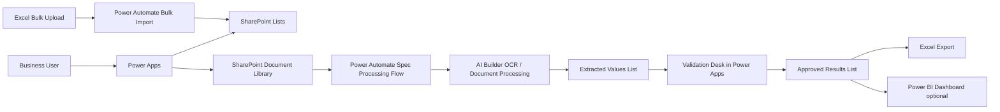

# Spec Sheet Data Extraction Tool — Microsoft 365 Low-Code Starter Kit

A GitHub-ready starter kit for building a Microsoft 365 tool that extracts, validates, manages, and exports structured product data from specification sheets.

This solution is designed for business users with basic Microsoft 365 skills. It uses:

- **SharePoint / Microsoft Lists** as the database
- **Power Apps** as the user interface
- **Power Automate** for workflows and file processing
- **AI Builder** for OCR and document extraction
- **Excel** for bulk upload and export
- Optional **Power BI** for analytics

---

## What this tool does

1. Manage product attributes and allowed values.
2. Upload up to 30 spec sheets per processing job.
3. Extract attribute values using AI Builder/OCR.
4. Match extracted values to your attribute library.
5. Let users review, edit, approve, reject, or flag values.
6. Export cleaned structured data to Excel.

---

## Repository contents

```text
specsheet-data-extraction-m365-starter/
├── README.md
├── docs/
│   ├── 01-architecture.md
│   ├── 02-data-model.md
│   ├── 03-ui-design.md
│   ├── 04-ai-builder-approach.md
│   ├── 05-implementation-plan.md
│   ├── 06-scalability-error-handling.md
│   ├── 07-security-roles.md
│   └── references.md
├── templates/
│   ├── Attribute_Bulk_Upload_Template.xlsx
│   └── Attribute_Bulk_Upload_Template.csv
├── sharepoint/
│   ├── sharepoint-list-schema.csv
│   └── create-lists-manually.md
├── power-apps/
│   ├── screens-and-controls.md
│   └── powerfx-snippets.md
├── power-automate/
│   ├── flow-01-create-processing-job.md
│   ├── flow-02-process-spec-sheets-ai.md
│   ├── flow-03-attribute-bulk-upload.md
│   └── flow-04-export-approved-results.md
├── ai-builder/
│   ├── extraction-prompt-template.md
│   ├── attribute-matching-rules.md
│   └── confidence-scoring-rules.md
└── .github/
    └── ISSUE_TEMPLATE/
        ├── bug_report.md
        └── feature_request.md
```

---

## Architecture overview



---

## Quick start for a non-developer

### Step 1 — Create the SharePoint site

Create a SharePoint site called:

```text
Spec Sheet Data Extraction
```

### Step 2 — Create the lists

Open:

```text
sharepoint/create-lists-manually.md
```

Create each SharePoint list exactly as shown.

### Step 3 — Upload the Excel template

Use:

```text
templates/Attribute_Bulk_Upload_Template.xlsx
```

Fill it with your attributes and allowed values.

### Step 4 — Build the Power Apps canvas app

Use:

```text
power-apps/screens-and-controls.md
power-apps/powerfx-snippets.md
```

Create screens for:

- Home
- Attribute Management
- Bulk Upload
- Spec Sheet Upload
- Validation Desk
- Results Dashboard
- Admin Settings

### Step 5 — Build Power Automate flows

Use the flow build guides in:

```text
power-automate/
```

Start with:

```text
flow-01-create-processing-job.md
flow-02-process-spec-sheets-ai.md
```

### Step 6 — Configure AI Builder

Use:

```text
ai-builder/extraction-prompt-template.md
ai-builder/attribute-matching-rules.md
ai-builder/confidence-scoring-rules.md
```

### Step 7 — Test with 3 spec sheets first

Do not start with 30 files. Test with 3 files, then 10, then 30.

---

## Recommended MVP

Build the first version with:

- 1 product category
- 20 to 50 attributes
- 5 test spec sheets
- 2 reviewers
- SharePoint list storage
- Excel export

After that works, expand to more product categories and larger batches.

---

## Important design note

For patch cords, pigtails, cables, and other industrial products, use a separate attribute library by material/category. Do not force all product categories into the same list of attributes. This improves extraction accuracy and validation speed.

---

## License

Use this starter kit internally as a business solution template. Add your company license policy before sharing publicly.
